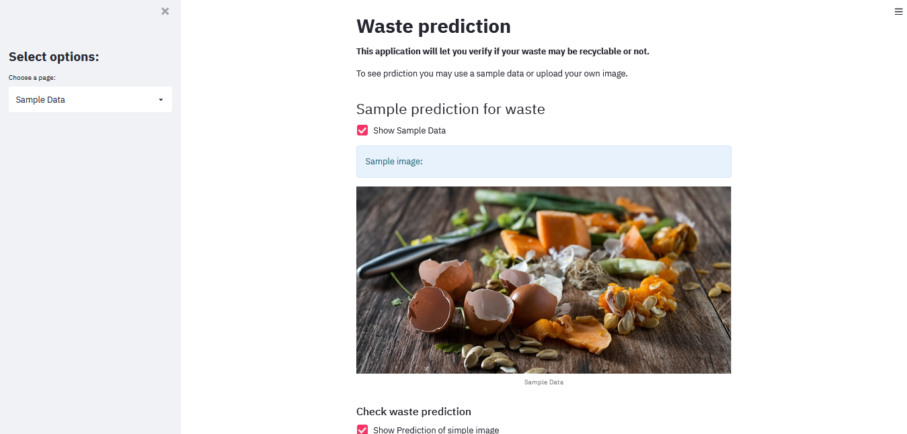

# Waste app with Streamlit

## General info

That is a simple Streamlit application with using a Deep Learning model to determine if a given waste are recycle or organic. 
We used a previous trained CNN (Convolutional Neural Networks) algorithm to detect waste. The project and code for this application is available [here](https://github.com/aniass/Waste-Classification).

**This Streamlit application is available [here](https://share.streamlit.io/aniass/waste-app/main/waste.py).**

## Technologies
Project is created with:

* Python 3.6
* libraries: streamlit, tensorflow, pillow.

**Running the app:**

To run this app install locally packages: 
```
pip install -r requirements.txt
```
Next download the project files to your system, then go to the folder/directory where these files reside and run the script:
```
streamlit run waste.py
```


### Streamlit app view:


